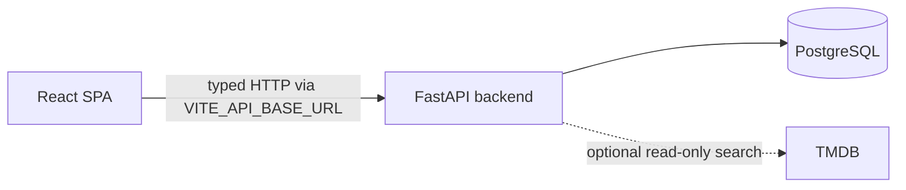

# Movie Recommendation Web

Frontend application for Movie Recommendation API.

## Requirements

- Node.js 24
- pnpm 12.5.1

## Installation

Install dependencies:

```bash
pnpm install --frozen-lockfile
```

Create a local environment file:

```bash
cp .env.example .env.local
```

## Development

Start the development server:

```bash
pnpm dev
```

Open http://localhost:5173 in the browser.

## Run the full stack locally

The frontend and backend are separate repositories. Keep them in sibling
directories so each project retains its own runtime, dependencies, and Git
history.

Start the backend first:

```bash
git clone https://github.com/darkskieshavefallen/movie-recommendation-api.git
cd movie-recommendation-api
cp .env.example .env
docker compose up --build
```

In another terminal, start this frontend:

```bash
git clone https://github.com/darkskieshavefallen/movie-recommendation-web.git
cd movie-recommendation-web
corepack enable
pnpm install --frozen-lockfile
cp .env.example .env.local
pnpm dev
```

The default `VITE_API_BASE_URL=http://127.0.0.1:8000` sends browser requests to
FastAPI. The backend CORS defaults allow the Vite origin at
`http://localhost:5173`. Verify the backend at http://127.0.0.1:8000/health and
then open the frontend at http://localhost:5173.

## Application structure

The frontend uses feature-based layers:

- `app` configures application-wide providers and the router.
- `routes` maps URLs to pages and contains no business logic.
- `pages` composes complete screens.
- `features` contains user actions and flows.
- `entities` contains domain models and entity-level UI.
- `shared` contains reusable infrastructure and UI.
- `mocks` contains test fixtures and API mocks.



The browser never connects to PostgreSQL or TMDB directly. FastAPI owns the
runtime HTTP contract and all provider credentials; the frontend consumes only
the committed OpenAPI snapshot described below.

TanStack Router generates the type-safe route tree from files in `src/routes`.
The generated `src/routeTree.gen.ts` file is committed but must not be edited manually.

| URL | Screen |
| --- | --- |
| `/movies` | Local movie catalog |
| `/movies/new` | Create movie |
| `/movies/:movieId` | Movie details |
| `/movies/:movieId/edit` | Edit movie |
| `/external-search?query=...` | External movie search |

## Design system

- Tailwind CSS 4.3 provides utility classes and CSS-first theme configuration.
- shadcn/ui components use Base UI primitives and live in `src/shared/ui`.
- Design tokens for colors, typography, spacing, and radius are defined in `src/index.css`.
- The light/dark theme follows the system preference on first visit and persists the user's choice.
- Lucide provides interface icons; decorative icons are hidden from assistive technology.

Add future shadcn components with:

```bash
pnpm dlx shadcn@latest add <component>
```

## API contract

The frontend HTTP contract is generated from the committed FastAPI OpenAPI
snapshot in `openapi/movie-recommendation-api.json`. Its backend source commit
is recorded in `openapi/README.md`.

Regenerate the types after updating the snapshot:

```bash
pnpm openapi:generate
```

All requests use the shared `openapi-fetch` client configured by
`VITE_API_BASE_URL`. `openapi-react-query` exposes typed query and mutation
hooks, and the application provides one shared TanStack Query client.

## Local catalog

The completed second web sprint provides:

- a responsive local movie grid backed by `GET /movies/`;
- URL pagination through validated `offset` and `limit` search parameters;
- direct movie detail routes backed by `GET /movies/{movie_id}`;
- explicit skeleton, empty, offline, retry, not-found, and API error states;
- safe query retries and reusable MSW fixtures for HTTP-boundary tests.

Component tests render the real router and TanStack Query provider, then use
React Testing Library and MSW to exercise the same links, buttons, and HTTP
requests as a user. Internal hooks are not mocked.

## CRUD MVP

The completed third web sprint adds the first full local catalog workflow:

- one React Hook Form and Zod 4 form shared by create and edit screens;
- client validation matching the public backend constraints, with FastAPI 422
  issues mapped back to the relevant fields;
- typed `POST /movies/`, full-replacement `PUT /movies/{movie_id}`, and
  `DELETE /movies/{movie_id}` mutations;
- detail and list cache synchronization without a full page reload;
- protected mutation buttons, accessible delete confirmation, safe CRUD toasts,
  and controlled `404`, `409`, network, and server error states.

Component tests include an HTTP-boundary CRUD journey from catalog to create,
detail, edit, catalog refresh, and deletion. Separate tests cover validation,
duplicate submits, cancellation, cache updates, and failed mutations preserving
the current UI state.

### Manual local CRUD smoke

With PostgreSQL and the backend running, start the frontend at
http://localhost:5173 and complete this flow without Swagger or a separate HTTP
client:

1. Open the catalog and choose **Create movie**.
2. Submit once with missing required fields and confirm inline validation.
3. Create a uniquely named smoke-test movie and confirm its detail page opens.
4. Edit every field, save, and confirm both detail and catalog show the changes.
5. Open the delete dialog, cancel once, reopen it, then confirm deletion.
6. Confirm the movie is absent from the catalog and a direct detail URL shows
   the not-found state.

Use `localhost` for the Vite origin. The backend CORS defaults allow
`http://localhost:5173`; opening Vite as `http://127.0.0.1:5173` is a different
origin and may be rejected.

### Current API limitations

- Catalog pagination uses `offset` and `limit`; the API does not return a total
  count.
- Movie updates are complete replacements via `PUT`, not partial `PATCH`
  updates.
- The local movie model has no poster or image fields.
- External search is read-only and there is no TMDB-to-local import endpoint.
- Authentication, authorization, and multi-user conflict resolution are not
  part of the current contract.
- Provider credentials remain backend-only and are never sent to the browser.

## Explainable recommendations

The completed fourth web sprint adds recommendations to each local movie detail
page:

- `GET /movies/{movie_id}/recommendations` is consumed through the shared typed
  API client and cached separately for every source movie and limit;
- recommendation cards preserve the backend order and show the exact matching
  genres returned by the API;
- the selected limit is stored in the URL and carried through recommendation
  links, so direct navigation and refresh reproduce the same view;
- loading, successful empty, safe error, and retry states are explicit;
- create, update, and delete operations invalidate affected recommendation
  caches so a previously empty or ranked result does not remain stale;
- responsive cards support long titles and genres, while view transitions
  respect `prefers-reduced-motion`.

### Manual local recommendation smoke

With the backend demo catalog and frontend running at the documented localhost
origins:

1. Open a movie that shares a genre with at least one other local movie.
2. Confirm recommendation order and matching-genre badges agree with the API
   response.
3. Change **Show recommendations** and confirm `limit` changes in the URL and
   the visible result count follows it.
4. Open a recommendation, refresh the detail route, and confirm both the source
   movie and selected limit remain correct.
5. Navigate back through a recommendation cycle and confirm content from the
   previous source is not retained.
6. Open a movie with no matches and confirm the empty state is presented as a
   successful result.
7. Create or edit a matching movie and confirm an already-open recommendation
   view refreshes instead of retaining its cached empty result.

## External movie search

The completed fifth web sprint adds an optional, read-only external catalog:

- `/external-search?query=...` keeps only submitted, normalized searches in the
  URL, so refresh and browser history reproduce the same result;
- provider responses are rendered through an application-owned movie shape and
  never added to the local PostgreSQL catalog;
- empty, disabled, authentication, rate-limit, timeout, unavailable, and
  unexpected-response states provide safe guidance without exposing raw
  provider payloads;
- transient failures retry only when the user asks;
- the page displays the required TMDB attribution, approved logo, and API terms
  link in every search state.

Component tests use MSW at the FastAPI HTTP boundary. They never call TMDB or
require provider credentials.

### Manual local external-search smoke

Start the frontend and backend at the documented localhost origins. Keep TMDB
disabled first and do not place a provider token in the frontend repository or
browser environment:

1. Open `/external-search`, submit **Alien**, and confirm the disabled-catalog
   state leaves the local catalog link available.
2. Confirm the TMDB credit, logo, API terms link, and read-only notice remain
   visible.
3. In the backend repository only, set `TMDB_ENABLED=true` and
   `TMDB_READ_ACCESS_TOKEN` in its ignored `.env`, then restart the API.
4. Submit one bounded **Alien** search and confirm normalized result cards load.
5. Open the local catalog and confirm no external result was saved.
6. Remove the token from captured terminal output, screenshots, issue comments,
   and logs; never publish the raw provider response.

The real-provider step is a manual smoke check only. CI and automated tests stay
deterministic and credential-free.

## Accessibility and responsive baseline

The Sprint 6 accessibility baseline covers the catalog, create form, movie
details and recommendations, external search, and destructive confirmation:

- navigation identifies the current page and moves focus to updated main
  content after client-side route changes;
- the skip link, forms, cards, recommendations, and delete dialog support
  keyboard-only operation, including dialog focus restoration on `Escape`;
- heading order and long movie content remain valid without forcing horizontal
  scrolling;
- skeletons, view transitions, dialogs, toasts, and loading indicators respect
  `prefers-reduced-motion`;
- axe-core checks the key rendered routes through the real router, query client,
  and MSW HTTP boundary.

Color contrast is verified separately because jsdom has no layout or canvas
color engine. The semantic light and dark text pairs meet WCAG AA, including
muted, primary, and destructive text.

### Manual responsive smoke

With the local stack running, check `/movies`, `/movies/new`, `/movies/1`,
`/movies/1/edit`, and `/external-search?query=Alien` at 320, 768, and 1440 CSS
pixels:

1. Confirm the page has no horizontal scrollbar or clipped controls.
2. Tab from the skip link through the header and primary action.
3. Follow a client-side link and confirm focus moves to the new main content.
4. Open the delete dialog with the keyboard, cycle within it, press `Escape`,
   and confirm focus returns to **Delete**.
5. Enable reduced motion and confirm loading indicators and overlays no longer
   animate.
6. Repeat the contrast and focus-ring check in light and dark themes.

## Checks

Run formatting, linting, and import organization checks:

```bash
pnpm check
```

Apply safe fixes and formatting:

```bash
pnpm check:fix
```

Run TypeScript type checking:

```bash
pnpm typecheck
```

Run unit tests once:

```bash
pnpm test
```

Install the Playwright Chromium binary once on a development machine:

```bash
pnpm exec playwright install chromium
```

Run the deterministic browser E2E suite:

```bash
pnpm test:e2e
```

Open Playwright UI mode while authoring a browser scenario:

```bash
pnpm test:e2e:ui
```

Playwright starts its own Vite server at `http://127.0.0.1:4173`. Browser API
requests are intercepted by the per-test in-memory API fixture, so E2E tests do
not require FastAPI, PostgreSQL, TMDB, or credentials. Every test receives fresh
movie state and may run independently or in parallel.

Screenshots and videos are retained only for failed tests. CI retries once and
records a trace for that retry; the HTML report and failure artifacts are
uploaded for seven days when the browser job fails.

Create a production build:

```bash
pnpm build
```

Preview the production build:

```bash
pnpm preview
```

Open http://localhost:4173 in the browser.

## Continuous integration

GitHub Actions runs the frozen pnpm install, formatting/linting and OpenAPI
drift check, TypeScript typecheck, unit tests, production build, and mandatory
Chromium E2E test for every pull request and every push to `main`. CI uses
Node.js from `.nvmrc` (Node 24) and caches the pnpm package store using
`pnpm-lock.yaml`; it does not cache `node_modules`, environment files, or
secrets.
