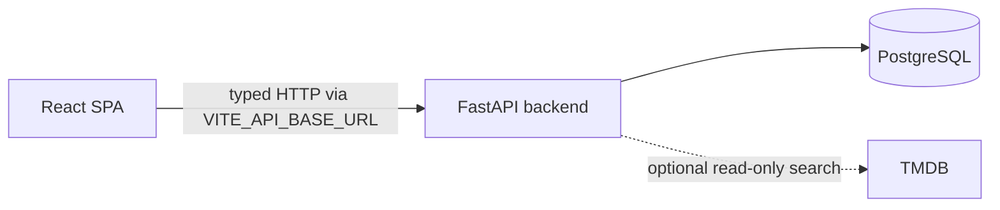

# Movie Recommendation Web

Frontend application for Movie Recommendation API.

## Requirements

- Node.js 24
- pnpm 12.5.1

## Installation

Install dependencies:

```bash
pnpm install --frozen-lockfile
```

Create a local environment file:

```bash
cp .env.example .env.local
```

## Development

Start the development server:

```bash
pnpm dev
```

Open http://localhost:5173 in the browser.

## Run the full stack locally

The frontend and backend are separate repositories. Keep them in sibling
directories so each project retains its own runtime, dependencies, and Git
history.

Start the backend first:

```bash
git clone https://github.com/darkskieshavefallen/movie-recommendation-api.git
cd movie-recommendation-api
cp .env.example .env
docker compose up --build
```

In another terminal, start this frontend:

```bash
git clone https://github.com/darkskieshavefallen/movie-recommendation-web.git
cd movie-recommendation-web
corepack enable
pnpm install --frozen-lockfile
cp .env.example .env.local
pnpm dev
```

The default `VITE_API_BASE_URL=http://127.0.0.1:8000` sends browser requests to
FastAPI. The backend CORS defaults allow the Vite origin at
`http://localhost:5173`. Verify the backend at http://127.0.0.1:8000/health and
then open the frontend at http://localhost:5173.

## Application structure

The frontend uses feature-based layers:

- `app` configures application-wide providers and the router.
- `routes` maps URLs to pages and contains no business logic.
- `pages` composes complete screens.
- `features` contains user actions and flows.
- `entities` contains domain models and entity-level UI.
- `shared` contains reusable infrastructure and UI.
- `mocks` contains test fixtures and API mocks.



The browser never connects to PostgreSQL or TMDB directly. FastAPI owns the
runtime HTTP contract and all provider credentials; the frontend consumes only
the committed OpenAPI snapshot described below.

TanStack Router generates the type-safe route tree from files in `src/routes`.
The generated `src/routeTree.gen.ts` file is committed but must not be edited manually.

| URL | Screen |
| --- | --- |
| `/movies` | Local movie catalog |
| `/movies/new` | Create movie |
| `/movies/:movieId` | Movie details |
| `/movies/:movieId/edit` | Edit movie |
| `/external-search?query=...` | External movie search |

## Design system

- Tailwind CSS 4.3 provides utility classes and CSS-first theme configuration.
- shadcn/ui components use Base UI primitives and live in `src/shared/ui`.
- Design tokens for colors, typography, spacing, and radius are defined in `src/index.css`.
- The light/dark theme follows the system preference on first visit and persists the user's choice.
- Lucide provides interface icons; decorative icons are hidden from assistive technology.

Add future shadcn components with:

```bash
pnpm dlx shadcn@latest add <component>
```

## API contract

The frontend HTTP contract is generated from the committed FastAPI OpenAPI
snapshot in `openapi/movie-recommendation-api.json`. Its backend source commit
is recorded in `openapi/README.md`.

Regenerate the types after updating the snapshot:

```bash
pnpm openapi:generate
```

All requests use the shared `openapi-fetch` client configured by
`VITE_API_BASE_URL`. `openapi-react-query` exposes typed query and mutation
hooks, and the application provides one shared TanStack Query client.

## Local catalog

The completed second web sprint provides:

- a responsive local movie grid backed by `GET /movies/`;
- URL pagination through validated `offset` and `limit` search parameters;
- direct movie detail routes backed by `GET /movies/{movie_id}`;
- explicit skeleton, empty, offline, retry, not-found, and API error states;
- safe query retries and reusable MSW fixtures for HTTP-boundary tests.

Component tests render the real router and TanStack Query provider, then use
React Testing Library and MSW to exercise the same links, buttons, and HTTP
requests as a user. Internal hooks are not mocked.

## Checks

Run formatting, linting, and import organization checks:

```bash
pnpm check
```

Apply safe fixes and formatting:

```bash
pnpm check:fix
```

Run TypeScript type checking:

```bash
pnpm typecheck
```

Run unit tests once:

```bash
pnpm test
```

Create a production build:

```bash
pnpm build
```

Preview the production build:

```bash
pnpm preview
```

Open http://localhost:4173 in the browser.

## Continuous integration

GitHub Actions runs the frozen pnpm install, formatting/linting and OpenAPI
drift check, TypeScript typecheck, unit tests, and production build for every
pull request and every push to `main`. CI uses Node.js from `.nvmrc` (Node 24)
and caches the pnpm package store using `pnpm-lock.yaml`; it does not cache
`node_modules`, environment files, or secrets.
